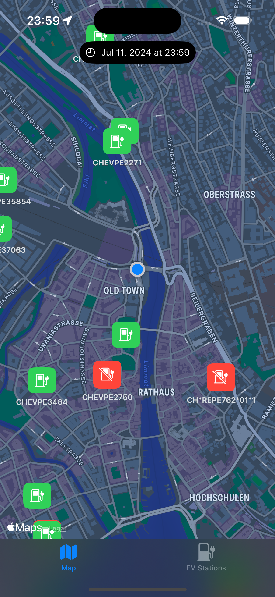
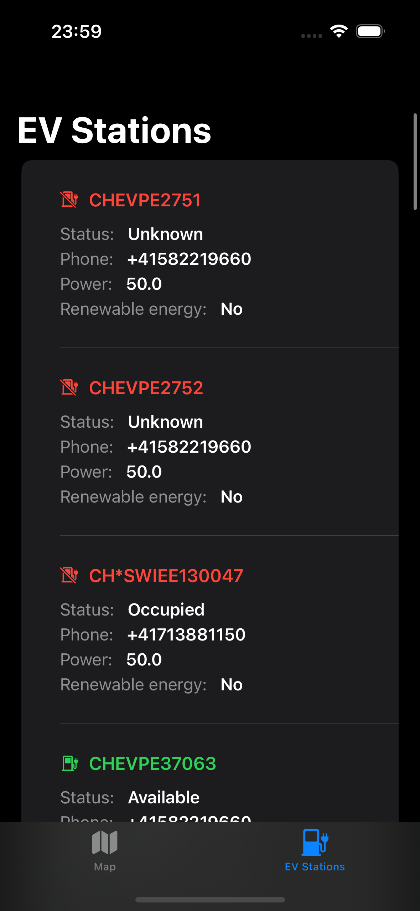

<!-- HEADER -->

<h1>Nearby Stations App</h1>

[][Swift]
[][iOS]
[][Twitter]

<!-- BODY -->
## Frameworks
- [SwiftUI framework](https://developer.apple.com/documentation/swiftui)
- [MapKit framework](https://developer.apple.com/documentation/mapkit/)
- [CoreLocation framework](https://developer.apple.com/documentation/corelocation/)
- [FileManager framework](https://developer.apple.com/documentation/foundation/filemanager)

## External dependencies
- None

## Data source
- [Swiss Federal Office of Energy](https://www.bfe.admin.ch/bfe/de/home.html)
- [Open Data Swiss](https://opendata.swiss/en/dataset/ladestationen-fuer-elektroautos)
- [Federal Office of Topography Swisstopo](https://map.geo.admin.ch)

## Description
This project is a native iOS application developed to assist electric car drivers in locating nearby charging stations and viewing their real-time availability status. The app utilizes data provided by the Swiss Confederation to display the locations and statuses of charging stations within a 1km radius of the user's current position.

## Implemented features
- Upon opening the app, a map is displayed, centered on the user's current location.
The initial map position is set to the user's location, providing an immediate view of nearby charging stations.
The map is not scrollable to ensure a fixed view centered around the user's location.

 - A second tab in the app presents a list of charging stations within a 1km radius of the user's position.
The list is sorted by "Power" in descending order, showing stations with the highest charging power at the top.

- The availability status of charging stations is updated automatically in real-time. A 'last update' field is included in the UI, indicating the most recent data update.

- The app synchronizes the list of available charging stations when internet connectivity is available.
When the app is opened without an internet connection, the last loaded list of charging stations is accessible.

## Preview
Those are the most relevant screenshots of the app.

	
    

<!-- FOOTER -->
<!-- Permanent links -->
[Swift]: https://www.swift.org
[iOS]: https://developer.apple.com/ios/
[Twitter]: https://twitter.com/TomEstelrich